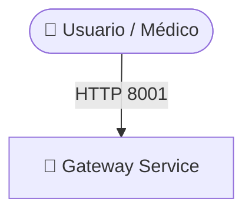
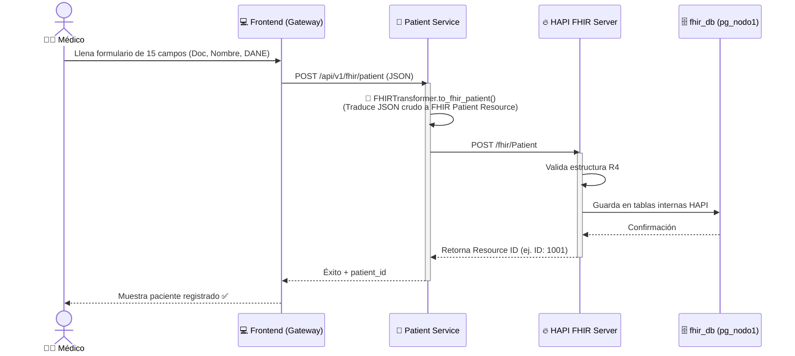
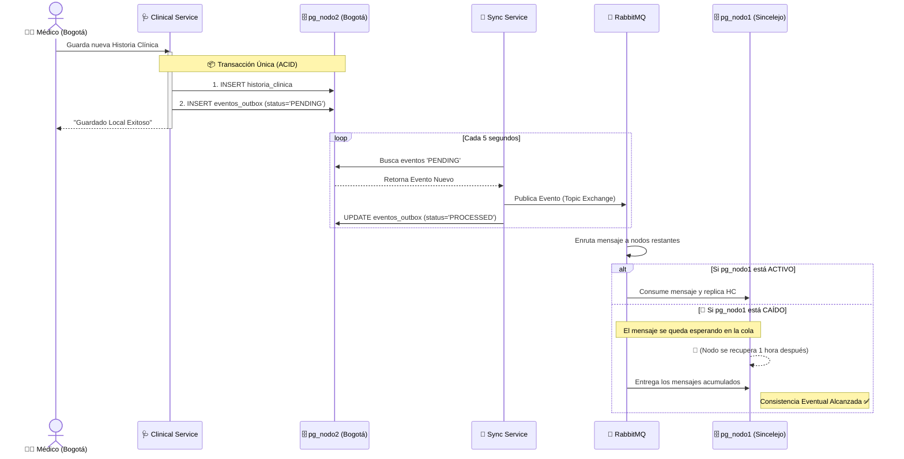

# 🏥 Análisis Exhaustivo del Sistema: Historia Clínica Distribuida NCS CLINICAL

El proyecto **NCS Clinical** es un Sistema Electrónico de Registros de Salud (EHR) avanzado. Destaca por su **arquitectura de microservicios distribuida**, alta disponibilidad mediante replicación asíncrona y cumplimiento del estándar de interoperabilidad internacional **FHIR R4**.

---

## 🏗️ 1. Arquitectura General del Sistema

El sistema opera bajo un enfoque de **Microservicios** contenerizados, coordinados mediante Docker. Se divide funcionalmente para separar la lógica de negocio, la interoperabilidad, la mensajería y la capa de datos.



### 🧩 Componentes Principales
- 🚪 **Gateway Service (`puerto 8001`)**: Es el punto de entrada unificado. Sirve el Frontend (vistas HTML/JS) y enruta las llamadas a la API hacia los servicios internos. [Ver Código](file:///home/leider/NCS.Clinical-Distribuido-main/services/gateway_service)
- 👤 **Patient Service (`puerto 8002`)**: Se centra exclusivamente en la demografía del paciente. Su misión es interactuar con el servidor FHIR para asegurar que todos los pacientes sigan el estándar internacional. [Ver Código](file:///home/leider/NCS.Clinical-Distribuido-main/services/patient_service)
- 🩺 **Clinical Service (`puerto 8003`)**: Maneja el volumen grueso de las historias clínicas (atenciones, triage, diagnósticos). Conecta directamente con los 3 nodos de base de datos para leer o escribir dependiendo de la sede del paciente. [Ver Código](file:///home/leider/NCS.Clinical-Distribuido-main/services/clinical_service)
- 🔄 **Sync Service (`puerto 8004`)**: Implementa el patrón *Outbox* para leer los cambios realizados localmente y esparcirlos por toda la red asegurando tolerancia a fallos. [Ver Código](file:///home/leider/NCS.Clinical-Distribuido-main/services/sync_service)

---

## 🗄️ 2. Bases de Datos y Sharding Geográfico

El sistema distribuye la carga mediante *Sharding Geográfico*. Existen 3 bases de datos independientes en PostgreSQL:

- 🇨🇴 **Sede Sincelejo (`pg_nodo1`, puerto 5433)**: 
  - Almacena atenciones de la costa.
  - 🌟 **Especial**: Aloja también la base de datos central de interoperabilidad `fhir_db` usada por HAPI FHIR.
- 🇨🇴 **Sede Bogotá (`pg_nodo2`, puerto 5434)**: Almacena atenciones y datos del centro del país.
- 🇨🇴 **Sede Medellín (`pg_nodo3`, puerto 5435)**: Almacena atenciones y datos de la región de Antioquia.

> [!NOTE]
> Cada vez que ocurre un registro clínico en un nodo, el sistema asíncrono se encarga de replicarlo para mantener la consistencia en caso de que una clínica busque los antecedentes de un paciente registrado en otra ciudad.

---

## 🔥 3. Interoperabilidad (HAPI FHIR)

Para cumplir con las normas globales de salud digital, se usa el estándar **FHIR R4**.
- 🌐 **HAPI FHIR Server (`puerto 8080`)**: Es un servidor Java dedicado que recibe los datos demográficos y los estructura bajo el recurso `Patient`. [Abrir Servidor FHIR](http://localhost:8080)
- 🔀 **Transformador Pydantic**: El backend Python traduce los formularios web de 15 campos a la estructura anidada y codificada JSON (Mapeos de Etnia, Género, DANE, ISO) requerida por FHIR.

---

## 📡 4. Flujos de Datos (Data Flows)

### 📝 4.1 Flujo de Registro de Paciente (Estándar FHIR)
Este flujo muestra cómo el formulario en pantalla termina siendo un registro estandarizado a nivel mundial.



### ♻️ 4.2 Sincronización Asíncrona Tolerante a Fallos (Patrón Outbox)
Este flujo explica qué pasa cuando hay atenciones clínicas y se cae un nodo.



---

## 📊 5. Observabilidad y Monitoreo

La salud del sistema puede verse visualmente gracias a su stack de monitoreo nativo:

- 📈 **Prometheus (`puerto 9090`)**: Scrapea (recolecta) métricas temporales de todo el ecosistema.
- 🔌 **Postgres Exporters (`puertos 9187, 9188, 9189`)**: Tres contenedores que leen el estado interno de PostgreSQL (locks, queries vivas, uso de caché) y las exponen para Prometheus.
- 📉 **Grafana (`puerto 3000`)**: Contiene Dashboards precargados para alertar sobre caída de nodos, cantidad de historias procesadas o cuellos de botella. [Abrir Dashboard Grafana](http://localhost:3000)

---

## 📂 6. Estructura de Directorios Clave

Navega por la arquitectura de código utilizando los siguientes enlaces:

```text
📦 NCS.Clinical-Distribuido-main
 ┣ 📂 backend/         ➔ 🏛️ [Código original unificado (Monolito)](file:///home/leider/NCS.Clinical-Distribuido-main/backend)
 ┣ 📂 services/        ➔ 🧩 [Nuevos Microservicios (FastAPI / Uvicorn)](file:///home/leider/NCS.Clinical-Distribuido-main/services)
 ┃ ┣ 📂 clinical_service/
 ┃ ┣ 📂 gateway_service/
 ┃ ┣ 📂 patient_service/
 ┃ ┗ 📂 sync_service/
 ┣ 📂 database/        ➔ 🗄️ [Scripts SQL de inicialización (Schemas, Roles)](file:///home/leider/NCS.Clinical-Distribuido-main/database)
 ┣ 📂 frontend/        ➔ 🎨 [Plantillas HTML, JS, CSS](file:///home/leider/NCS.Clinical-Distribuido-main/frontend)
 ┣ 📂 monitoring/      ➔ 📊 [Configuraciones de Grafana y Prometheus](file:///home/leider/NCS.Clinical-Distribuido-main/monitoring)
 ┣ 📂 scripts/         ➔ ⚙️ [Bash scripts para tests (test-mvp-fhir.sh)](file:///home/leider/NCS.Clinical-Distribuido-main/scripts)
 ┣ 📜 app.py           ➔ 🐍 [Punto de entrada original de la app de Flask/FastAPI](file:///home/leider/NCS.Clinical-Distribuido-main/app.py)
 ┗ 🐳 docker-compose.yml ➔ 🚢 [Declaración de los 14 contenedores](file:///home/leider/NCS.Clinical-Distribuido-main/docker-compose.yml)
```

---

## 🚀 7. Enlaces y Ejecución Rápida

Para iniciar todos los servicios del proyecto:

```bash
# Entrar al directorio
cd /home/leider/NCS.Clinical-Distribuido-main

# Levantar infraestructura completa
docker compose up -d --build
```

### 🔗 Enlaces Rápidos a Servicios (Localhost)

| 🛑 Servicio | 🔗 URL de Acceso | 📝 Descripción |
|---|---|---|
| **Dashboard Principal** | [http://localhost:8001](http://localhost:8001) | Vista general (Frontend UI) |
| **Registro Pacientes (FHIR)** | [http://localhost:8001/registro-paciente](http://localhost:8001/registro-paciente) | Formulario de 15 campos estándar |
| **Consulta H.C.** | [http://localhost:8001/consulta-hc](http://localhost:8001/consulta-hc) | Motor de búsqueda de pacientes |
| **API Docs (Swagger)** | [http://localhost:8001/docs](http://localhost:8001/docs) | Documentación interactiva de la API |
| **HAPI FHIR Server** | [http://localhost:8080](http://localhost:8080) | Consola y servidor de interoperabilidad |
| **Grafana (Monitoreo)** | [http://localhost:3000](http://localhost:3000) | Métricas en tiempo real *(User/Pass: admin/admin)* |
| **RabbitMQ Admin** | [http://localhost:15672](http://localhost:15672) | Gestor de colas de mensajería |
Autores Danilo Diaz - Brayan Portacio 
